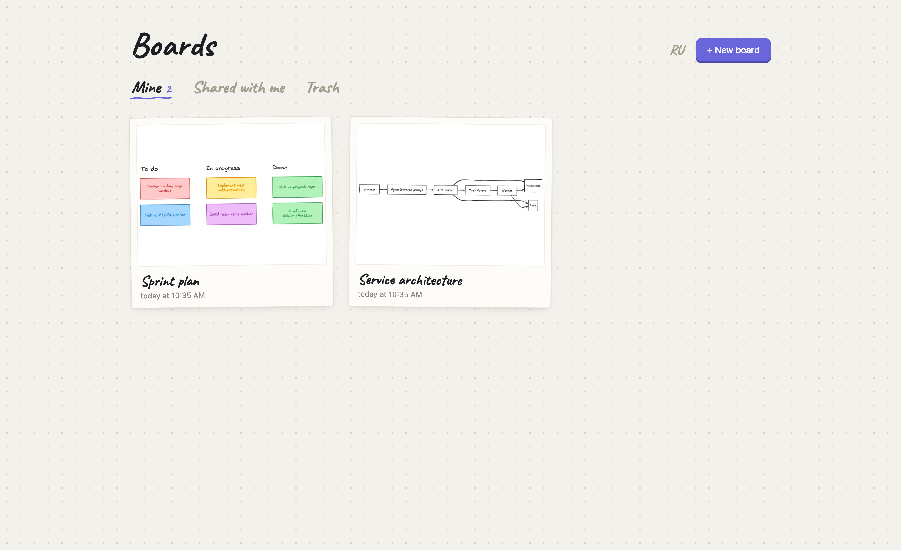
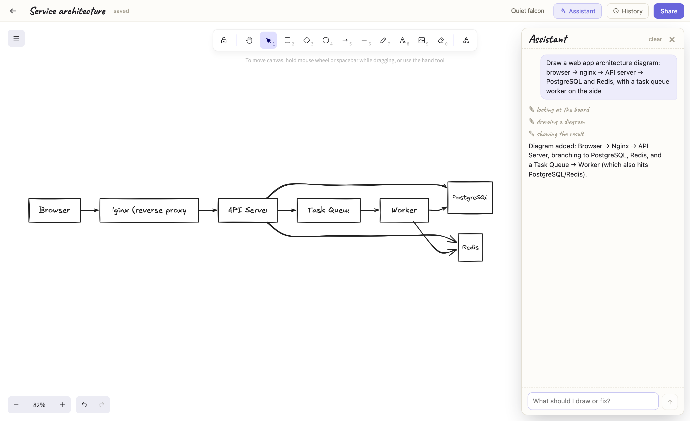

# Boards

**English** | [Русский](README.ru.md)

Self-hosted multi-board [Excalidraw](https://github.com/excalidraw/excalidraw): a personal "Excalidraw+" on your own server — one Docker container, no accounts, no database. With an optional AI assistant that draws on your boards.



## Features

- **Multiple boards** — a dashboard with live thumbnails, inline rename, tilt-on-hover paper cards
- **Everyone gets their own boards** — anonymous cookie identity, zero signup
- **Share by link** — separate *edit* and *view-only* links, revocable at any time
- **Realtime co-drawing** — WebSocket rooms, edits merged via `reconcileElements`
- **Live cursors & follow mode** — Miro-style presence with name tags; click an avatar to follow their camera. Game-netcode smoothing: adaptive jitter buffer, Catmull-Rom splines, dead reckoning
- **Version history** — auto-snapshots every 10 minutes of work, visual preview, one-click restore
- **Trash** — soft delete, restore within 30 days, then auto-purge
- **PWA** — installs on phone and desktop like an app
- **English & Russian UI** — auto-detected from the browser, switchable on the dashboard

## AI assistant (optional)



A chat panel beside the board: ask it to draw a diagram, lay ideas out as sticky notes, recolor, align, or tidy up — it sees the live scene and draws right onto it. Voice input via an external ASR service.

- Runs on a **Claude subscription** via the [Claude Agent SDK](https://docs.anthropic.com/en/api/agent-sdk/overview) — a sidecar container (`agent/`) that needs an authorized [Claude CLI](https://docs.anthropic.com/en/docs/claude-code) on the host (its `~/.claude` OAuth creds are mounted in). No API keys.
- Tools (`get_scene`, `add_mermaid`, `add_elements`, `update_elements`, `delete_elements`, `zoom_to`) are relayed over WebSocket and **executed in the user's browser** against the live `excalidrawAPI` — the assistant's edits go through the normal collab sync: every participant sees them, and Ctrl/Cmd+Z works.
- Each board keeps its own conversation (survives page reloads, resets after 24 h idle).
- Available to the board owner and edit-link collaborators; view-only visitors don't get it.
- Without the `agent` container the app just works as usual — the chat simply isn't there.

## Stack

- Frontend: Vite + React 19 + `@excalidraw/excalidraw` (+ `@excalidraw/mermaid-to-excalidraw`, lazy-loaded)
- Backend: zero-framework Node.js (`server.js`) + `ws`; boards stored as JSON files
- Assistant: FastAPI + `claude-agent-sdk` sidecar (`agent/`)
- Deploy: Docker Compose, data in volumes

## Quick start

```bash
npm install
npm run build
docker compose up -d --build
# app at http://localhost:48372
```

For the AI assistant, make sure the host has an authorized Claude CLI (`~/.claude`), and optionally set `ASR_UPSTREAM` for voice input (see below).

Development:

```bash
node server.js          # API + WS on :3199
npm run dev             # Vite with a proxy to :3199
```

### Environment variables

| Variable | Default | What it does |
|---|---|---|
| `PORT` / `DATA_DIR` | `3199` / `/data` | app port and data dir (see `docker-compose.yml`) |
| `AGENT_UPSTREAM` | `agent:8000` | assistant sidecar address; empty — assistant off |
| `CLAUDE_MODEL` | `sonnet` | assistant model (`sonnet`/`opus`/`haiku`) |
| `CLAUDE_DIR` / `CLAUDE_JSON` | `~/.claude` / `~/.claude.json` | Claude CLI creds mounted into the sidecar |
| `ASR_UPSTREAM` | — | speech-to-text endpoint URL (multipart field `audio`, WAV 16 kHz); empty — no mic button |
| `TZ` | `Europe/Moscow` | sidecar timezone |

## Licenses

- This project — [MIT](LICENSE)
- [Excalidraw](https://github.com/excalidraw/excalidraw) — MIT © Excalidraw contributors
- Caveat font — SIL OFL 1.1

Not affiliated with Excalidraw — this is an independent self-hosted wrapper around their open-source editor.
