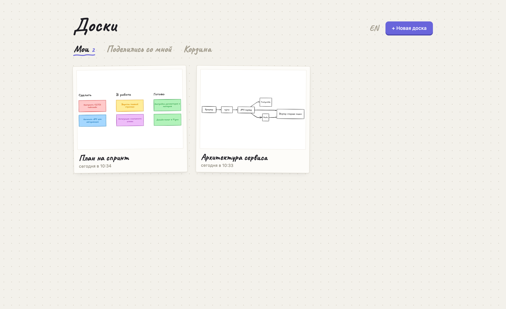
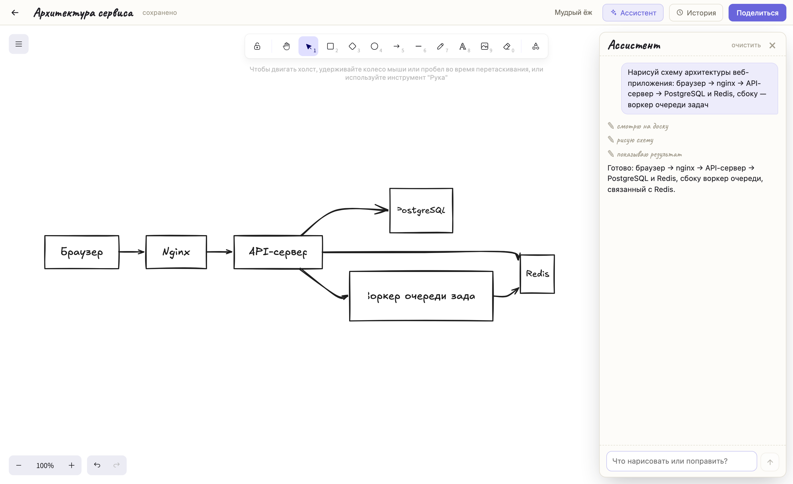

# Доски

[English](README.md) | **Русский**

Self-hosted мультидосочный [Excalidraw](https://github.com/excalidraw/excalidraw): личный «Excalidraw+» на своём сервере — один Docker-контейнер, без регистрации и базы данных. С опциональным AI-ассистентом, который рисует прямо на досках.



## Возможности

- **Несколько досок** — дашборд с живыми превью, переименование на месте, бумажные карточки
- **Свои доски у каждого** — анонимная идентификация по куке, никакой регистрации
- **Шаринг по ссылке** — отдельные ссылки на *редактирование* и *только просмотр*, отзыв доступа в любой момент
- **Совместное рисование в реальном времени** — WebSocket-комнаты, слияние правок через `reconcileElements`
- **Живые курсоры и следование** — присутствие как в Miro, клик по аватару — камера следует за участником. Сглаживание уровня игрового неткода: адаптивный джиттер-буфер, сплайны Катмулла-Рома, dead reckoning
- **История версий** — автоснапшоты каждые 10 минут работы, превью и откат в один клик
- **Корзина** — мягкое удаление, восстановление в течение 30 дней, потом автоочистка
- **PWA** — ставится на телефон и десктоп как приложение
- **Русский и английский интерфейс** — определяется по браузеру, переключается на дашборде

## AI-ассистент (опционально)



Чат сбоку доски: попросите нарисовать схему, разложить мысли по стикерам, перекрасить, выровнять или навести порядок — он видит живую сцену и рисует прямо в неё. Голосовой ввод через внешний ASR-сервис.

- Работает на **подписке Claude** через [Claude Agent SDK](https://docs.anthropic.com/en/api/agent-sdk/overview) — sidecar-контейнер (`agent/`), которому нужен авторизованный [Claude CLI](https://docs.anthropic.com/en/docs/claude-code) на хосте (его OAuth-креды `~/.claude` монтируются внутрь). Без API-ключей.
- Инструменты (`get_scene`, `add_mermaid`, `add_elements`, `update_elements`, `delete_elements`, `zoom_to`) передаются по WebSocket и **исполняются в браузере пользователя** поверх живого `excalidrawAPI` — правки ассистента идут обычным путём совместного редактирования: их видят все участники, работает Ctrl/Cmd+Z.
- У каждой доски свой разговор (переживает перезагрузку страницы, сбрасывается после 24 ч простоя).
- Доступен владельцу доски и пришедшим по edit-ссылке; в режиме «только просмотр» ассистента нет.
- Без контейнера `agent` приложение работает как обычно — просто нет чата.

## Стек

- Фронтенд: Vite + React 19 + `@excalidraw/excalidraw` (+ `@excalidraw/mermaid-to-excalidraw`, лениво)
- Бэкенд: Node.js без фреймворков (`server.js`) + `ws`; доски хранятся JSON-файлами
- Ассистент: sidecar на FastAPI + `claude-agent-sdk` (`agent/`)
- Деплой: Docker Compose, данные в volume

## Запуск

```bash
npm install
npm run build
docker compose up -d --build
# приложение на http://localhost:48372
```

Для AI-ассистента на хосте должен быть авторизованный Claude CLI (`~/.claude`); для голосового ввода задайте `ASR_UPSTREAM` (см. ниже).

Для разработки:

```bash
node server.js          # API+WS на :3199
npm run dev             # Vite с прокси на :3199
```

### Переменные окружения

| Переменная | По умолчанию | Что делает |
|---|---|---|
| `PORT` / `DATA_DIR` | `3199` / `/data` | порт приложения и каталог данных (см. `docker-compose.yml`) |
| `AGENT_UPSTREAM` | `agent:8000` | адрес sidecar-а ассистента; пусто — ассистент выключен |
| `CLAUDE_MODEL` | `sonnet` | модель ассистента (`sonnet`/`opus`/`haiku`) |
| `CLAUDE_DIR` / `CLAUDE_JSON` | `~/.claude` / `~/.claude.json` | креды Claude CLI, монтируются в sidecar |
| `ASR_UPSTREAM` | — | URL эндпоинта распознавания речи (multipart-поле `audio`, WAV 16 кГц); пусто — кнопки микрофона нет |
| `TZ` | `Europe/Moscow` | часовой пояс sidecar-а |

## Лицензии

- Этот проект — [MIT](LICENSE)
- [Excalidraw](https://github.com/excalidraw/excalidraw) — MIT © Excalidraw contributors
- Шрифт Caveat — SIL OFL 1.1

Проект не аффилирован с Excalidraw — это независимая self-hosted обёртка вокруг их open-source редактора.
